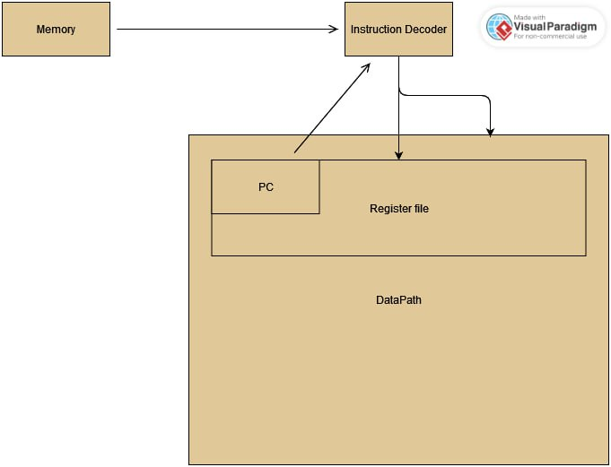

# csa lab 3

## вариант
- Каплан Дмитрий Денисович P33131
- lisp | risc | neum | hw | instr | binary | stream | mem | cstr | prob5 | pipeline
- Без усложнения
## Язык программирования
LISP-подобный язык, статическая типизация, 

```BNF
kotlisp : fun*;
fun : OP 'fun' NAME s_expression CP;

s_expression: OP (variable | loop | conditional | fun_call | print_ | math_expression | read_line)? s_expression* CP;

math_expression : ((STRING | list_ | NUMBER | NAME | BOOLEAN  | index)
                        |
                      ( (PLUS | MINUS | MULT | DIV | XOR | AND | OR | EQUALS | NOT_EQUALS | GREATER | GREATER_OR_EQUALS | LESS | LESS_OR_EQUALS | MOD)
                      (list_ | NUMBER | NAME | BOOLEAN | index)+));


list_ : 'list' OP (NUMBER+ | STRING+ | BOOLEAN+) CP;

fun_call : NAME OP CP;

variable : 'setq' NAME s_expression;

loop: 'dotimes' OP NAME (NUMBER | NAME) CP s_expression;

conditional: 'if' s_expression s_expression s_expression;

index : NAME '[' (NUMBER | NAME) ']';

print_: 'print' s_expression;

read_line: 'read-line' OP ('int' | 'str' | 'bool') CP;

PLUS : '+';
MINUS : '-';
MULT : '*';
DIV : '/';
XOR : '^';
AND: '&';
MOD: '%';
OR: '|';
EQUALS : '=';
NOT_EQUALS : '!=';
GREATER : '>';
GREATER_OR_EQUALS : '>=';
LESS : '<';
LESS_OR_EQUALS : '<=';
OP : '(';
CP : ')';

NUMBER : '-'? DIGIT+ ;
BOOLEAN : ('true' | 'false');
STRING : '"'(LETTER | DIGIT | WHITESPACE | '?' | '!' | '>' | '<' | ',' | '.'| '\\n')+'"';
NAME: LETTER+;
WHITESPACE : [\r\n\t ,]+ -> skip;
COMMENT: ('#' (LETTER | DIGIT | WHITESPACE)*) -> skip;
fragment DIGIT : '0'..'9';
fragment LETTER : LOWER | UPPER ;
fragment LOWER : ('a'..'z') ;
fragment UPPER : ('A'..'Z') ;
```

Пример:

```lisp
(fun main(
        (setq l (list(1, 2, 3, 4, 5, 6)))
        (setq length (6))
        (setq sum (0))
        (dotimes (i length)(
            (setq sum (+ sum l[i]))
            )
        )
        (print(sum))
    )
)
```

## Организация памяти
Register file:

```
- reg0 - general purpose
- reg1 - general purpose
- reg2 - general purpose
- reg3 - general purpose
- reg4 - INSTRUCTION POINTER
- reg5 - STACK POINTER
- reg6 - INSTRUCTION EDGE POINTER
- reg7 - general purpose
```

Аллокатор компилятора статически связывает переменные с локациями памяти


### Работа со строковыми литералами:

- "\0" терминированные строки
- строковые литералы располагаются в конце бинарника

## Система команд

- RISC, register-to-register, взаимодействие с памятью происходит только через LD/SV/PRT
- Взаимодействие со внешними устройствами происходит через записи, чтения в соответствующие замапленные адреса памяти

Цикл команды:
- Загрузка IP
- Прочтение из памяти
- Декод инструкции
- Загрузка операндов
- Сдвиг IP
- Выполнение команды

### Набор инструкций
- ADD
- SUB
- MUL
- IDIV
- OR
- XOR
- INC - increments
- NEG - negates the number
- EQ - =
- NEQ - !=
- GREQ - >= 
- LS - <
- LSEQ - <= 
- PUSH - пуш в стэк
- POP - поп из стэке
- RET - return from a call
- HLT - halt machine
- LDC - load constant
- LD - load from memory
- MOV - перемещение между регистрами
- CALL - call a function
- BRMN - branch if < 0
- JMP - безусловный переход
- BRPL - branch if > 0
- MOD - остаток от деления
- PRT - шорткат для SV на внешнее устройство
- RDL - шорткат для LD из внешнего устройства

### Кодирование инструкций

- Бинарные файлы, размер каждой команды 8 байт

## Транслятор
Вызов: `kotlisp/main.py input_source_file output_binary_file`

## Модель процессора
Вызов: `klvm/main.py binary_executable input_file`

### ControlUnit
- Метод run имплементирует исполнение по инструкциям
- Загружает команды в DataPath и подаёт АЛУ сигнал на исполнение



### Datapath


- 8 регистров прямого использования
- hardwired имплементация каждой команды
