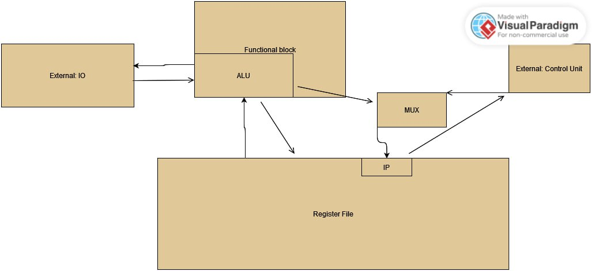

# csa lab 3

## вариант
- Каплан Дмитрий Денисович P33131
- lisp | risc | neum | hw | instr | binary | stream | mem | cstr | prob5 | pipeline
- Без усложнения
## Язык программирования
LISP-подобный язык

```BNF
kotlisp : fun*;
fun : OP 'fun' NAME s_expression CP;

s_expression: OP (variable | loop | conditional | fun_call | print_ | math_expression | read_line | s_expression)* CP;

math_expression : ((STRING | list_ | NUMBER | NAME | BOOLEAN  | index)
                        |
                      ( (PLUS | MINUS | MULT | DIV | XOR | AND | OR | EQUALS | NOT_EQUALS | GREATER | GREATER_OR_EQUALS | LESS | LESS_OR_EQUALS | MOD)
                      (list_ | NUMBER | NAME | BOOLEAN | index)+));


list_ : 'list' OP (NUMBER+ | STRING+ | BOOLEAN+) CP;

fun_call : NAME OP CP;

variable : 'setq' NAME s_expression;

loop: 'dotimes' OP NAME (NUMBER | NAME) CP s_expression;

conditional: 'if' s_expression s_expression s_expression;

index : NAME '[' (NUMBER | NAME) ']';

print_: 'print' s_expression;

read_line: 'read-line' OP ('int' | 'str' | 'bool') CP;

PLUS : '+';
MINUS : '-';
MULT : '*';
DIV : '/';
XOR : '^';
AND: '&';
MOD: '%';
OR: '|';
EQUALS : '=';
NOT_EQUALS : '!=';
GREATER : '>';
GREATER_OR_EQUALS : '>=';
LESS : '<';
LESS_OR_EQUALS : '<=';
OP : '(';
CP : ')';

NUMBER : '-'? DIGIT+ ;
BOOLEAN : ('true' | 'false');
STRING : '"'(LETTER | DIGIT | WHITESPACE | '?' | '!' | '>' | '<' | ',' | '.'| '\\n')+'"';
NAME: LETTER+;
WHITESPACE : [\r\n\t ,]+ -> skip;
COMMENT: ('#' (LETTER | DIGIT | WHITESPACE)*) -> skip;
fragment DIGIT : '0'..'9';
fragment LETTER : LOWER | UPPER ;
fragment LOWER : ('a'..'z') ;
fragment UPPER : ('A'..'Z') ;
```
- Стратегия вычисления: проходом по дереву составленному из S-выражений начиная с самого глубокого уровня транслятор просчитывает значения всех выражений, передавая ссылки результатов на верх

- У всех переменных глобальный скоуп с декларацией происходящей при ин-ордер травёрсинге дерева

- Cтатическая типизация

- Виды литералов: Знаковые целые числа, Строки, Логические 

Пример:

```lisp
(fun main(
        (setq l (list(1, 2, 3, 4, 5, 6)))
        (setq length (6))
        (setq sum (0))
        (dotimes (i length)(
            (setq sum (+ sum l[i]))
            )
        )
        (print(sum))
    )
)
```

## Организация памяти

- Общая память для инструкций и данных
- Размер машинного слова: 8 байт
- Варианты адресации: Прямая адресация
- Механика отображения программы и данных на процессор: Данные из бинарного файла преобразуются в числовые и загружаются в память с 0го адреса

Register file:

```
- reg0 - general purpose
- reg1 - general purpose
- reg2 - general purpose
- reg3 - general purpose
- reg4 - INSTRUCTION POINTER
- reg5 - STACK POINTER
- reg6 - INSTRUCTION EDGE POINTER
- reg7 - general purpose
```

- Все переменные и литералы статически аллоцируются
- Динамические данные хранятся на стеке, а статические сразу после последней инструкции программы

- Аллокатор компилятора статически связывает переменные с локациями памяти
- Литералы и переменные сохраняются в статическую память в порядке очереди их объявления.
- В результаты всех математических операций ссылка на значение передается к REG1
- Структуры и типы, которые могут занимать несколько машинных слов: Строки и Массивы(ака Списки)
- Строка разбивается на части по 8 байт, в конце идет нуль-терминатор, ссылка на строку указывает на первые ее 8 байт(или меньше, если строка размером меньше)
- Списки хранятся по одному значению в одну ячейку, ссылка на список указывает на первый элемент
- На стеке хранятся только адреса возврата


### Работа со строковыми литералами:

- "\0" терминированные строки
- строковые литералы располагаются в конце бинарника

## Система команд

- RISC, register-to-register, взаимодействие с памятью происходит только через LD/SV/PRT
- Взаимодействие со внешними устройствами происходит через записи, чтения в соответствующие замапленные адреса памяти

Цикл команды:
- Загрузка IP
- Прочтение из памяти
- Декод инструкции
- Загрузка операндов
- Сдвиг IP
- Выполнение команды

### Набор инструкций
- ADD
- SUB
- MUL
- IDIV
- OR
- XOR
- INC - increments
- NEG - negates the number
- EQ - =
- NEQ - !=
- GREQ - >= 
- LS - <
- LSEQ - <= 
- PUSH - пуш в стэк
- POP - поп из стэке
- RET - return from a call
- HLT - halt machine
- LDC - load constant
- LD - load from memory
- MOV - перемещение между регистрами
- CALL - call a function
- BRMN - branch if < 0
- JMP - безусловный переход
- BRPL - branch if > 0
- MOD - остаток от деления
- PRT - шорткат для SV на внешнее устройство
- RDL - шорткат для LD из внешнего устройства

### Кодирование инструкций

- Бинарные файлы, размер каждой команды 8 байт

## Транслятор
Вызов: `kotlisp/main.py input_source_file output_binary_file`

## Модель процессора
Вызов: `klvm/main.py binary_executable input_file`

### ControlUnit
- Метод run имплементирует исполнение по инструкциям
- Загружает команды в DataPath и подаёт АЛУ сигнал на исполнение


### Datapath



- 8 регистров прямого использования
- hardwired имплементация каждой команды

## Тестирование

- Разработанные тесты проверяют функционал языка на узких местах
- CI загружает нужные библиотеки для работы, такие как antlr4-runtime, typeguard и тд.
- Часть линтера была отключена, потому что она жалуется на код, сгенерированный через antlr


#### hello.klp

```hello.klp
(fun main(
        (print("hello world"))
    )
)
```

#### cat.klp

```cat.klp
( fun main(
        (setq string (read-line(str)))
        (print(string))
    )
)
```

#### hello_user_name.klp

```hello_user_name.klp
(fun main(
        (print ("> What is your name?\n"))
        (print("< "))
        (setq name (read-line(str)))
        (print ("> Hello, "))
        (print (name))
        (print ("!\n"))

    )
)
```


#### prob5.klp

```prob5.klp
(fun main(
       (setq result (1))
       (setq getNokResult (0))
       (dotimes (j 19) (
                (setq argumentOneGetNok (result))
                (setq argumentTwoGetNok (+ j 2))
                (getNok())
                (setq result (getNokResult))
            )
       )
       (print(result))
    )
)

(fun getNok(
       (setq argumentOneGetNod (argumentOneGetNok))
       (setq argumentTwoGetNod (argumentTwoGetNok))
       (setq getNodResult (0))
       (getNod())
       (setq getNokResult (* argumentOneGetNok argumentTwoGetNok))
       (setq getNokResult (/ getNokResult getNodResult))
    )
)

(fun getNod (
        (setq length (1))
        (dotimes (i length) (

                (if(> argumentOneGetNod argumentTwoGetNod)
                    (setq argumentOneGetNod (% argumentOneGetNod argumentTwoGetNod))
                    (setq argumentTwoGetNod (% argumentTwoGetNod argumentOneGetNod))
                )

                (if(& argumentOneGetNod argumentTwoGetNod)
                    (setq length (+ length 1))
                    (

                        (setq getNodResult (if(> argumentOneGetNod argumentTwoGetNod)
                            (argumentOneGetNod)
                            (argumentTwoGetNod)
                            )
                        )
                        (setq length (0))
                    )
                )
            )
        )
    )
)
```


#### sum_of_list.klp

```sum_0f_list.klp
(fun main(
        (setq l (list(1, 2, 3, 4, 5, 6)))
        (setq length (6))
        (setq sum (0))
        (dotimes (i length)(
            (setq sum (+ sum l[i]))
            )
        )
        (print(sum))
    )
)

```

### Работа алгоритма 

## бинарный код


## debug
```
DEBUG:root:1 LDC -> REG1 6
DEBUG:root:4 LDC -> REG2 105
DEBUG:root:7 SV -> REG2 REG1
DEBUG:root:10 LDC -> REG1 0
DEBUG:root:13 LDC -> REG2 106
DEBUG:root:16 SV -> REG2 REG1
DEBUG:root:19 LDC -> REG3 106
DEBUG:root:22 LD -> REG1 REG3
DEBUG:root:25 LDC -> REG4 99
DEBUG:root:28 LDC -> REG3 107
DEBUG:root:31 LD -> REG5 REG3
DEBUG:root:34 ADD ->REG4  + REG5
DEBUG:root:37 LD -> REG2 REG4
DEBUG:root:40 ADD ->REG1  + REG2
DEBUG:root:43 LDC -> REG2 106
DEBUG:root:46 SV -> REG2 REG1
DEBUG:root:49 LDC -> REG3 107
DEBUG:root:52 LD -> REG1 REG3
DEBUG:root:55 INC -> REG1  + 1
DEBUG:root:57 LDC -> REG2 107
DEBUG:root:60 SV -> REG2 REG1
DEBUG:root:63 LDC -> REG3 105
DEBUG:root:66 LD -> REG2 REG3
DEBUG:root:69 SUB -> REG2 - REG1
DEBUG:root:72 LDC -> REG1 18
DEBUG:root:16 BRPL -> REG2
DEBUG:root:19 LDC -> REG3 106
DEBUG:root:22 LD -> REG1 REG3
DEBUG:root:25 LDC -> REG4 99
DEBUG:root:28 LDC -> REG3 107
DEBUG:root:31 LD -> REG5 REG3
DEBUG:root:34 ADD ->REG4  + REG5
DEBUG:root:37 LD -> REG2 REG4
DEBUG:root:40 ADD ->REG1  + REG2
DEBUG:root:43 LDC -> REG2 106
DEBUG:root:46 SV -> REG2 REG1
DEBUG:root:49 LDC -> REG3 107
DEBUG:root:52 LD -> REG1 REG3
DEBUG:root:55 INC -> REG1  + 1
DEBUG:root:57 LDC -> REG2 107
DEBUG:root:60 SV -> REG2 REG1
DEBUG:root:63 LDC -> REG3 105
DEBUG:root:66 LD -> REG2 REG3
DEBUG:root:69 SUB -> REG2 - REG1
DEBUG:root:72 LDC -> REG1 18
DEBUG:root:16 BRPL -> REG2
DEBUG:root:19 LDC -> REG3 106
DEBUG:root:22 LD -> REG1 REG3
DEBUG:root:25 LDC -> REG4 99
DEBUG:root:28 LDC -> REG3 107
DEBUG:root:31 LD -> REG5 REG3
DEBUG:root:34 ADD ->REG4  + REG5
DEBUG:root:37 LD -> REG2 REG4
DEBUG:root:40 ADD ->REG1  + REG2
DEBUG:root:43 LDC -> REG2 106
DEBUG:root:46 SV -> REG2 REG1
DEBUG:root:49 LDC -> REG3 107
DEBUG:root:52 LD -> REG1 REG3
DEBUG:root:55 INC -> REG1  + 1
DEBUG:root:57 LDC -> REG2 107
DEBUG:root:60 SV -> REG2 REG1
DEBUG:root:63 LDC -> REG3 105
DEBUG:root:66 LD -> REG2 REG3
DEBUG:root:69 SUB -> REG2 - REG1
DEBUG:root:72 LDC -> REG1 18
DEBUG:root:16 BRPL -> REG2
DEBUG:root:19 LDC -> REG3 106
DEBUG:root:22 LD -> REG1 REG3
DEBUG:root:25 LDC -> REG4 99
DEBUG:root:28 LDC -> REG3 107
DEBUG:root:31 LD -> REG5 REG3
DEBUG:root:34 ADD ->REG4  + REG5
DEBUG:root:37 LD -> REG2 REG4
DEBUG:root:40 ADD ->REG1  + REG2
DEBUG:root:43 LDC -> REG2 106
DEBUG:root:46 SV -> REG2 REG1
DEBUG:root:49 LDC -> REG3 107
DEBUG:root:52 LD -> REG1 REG3
DEBUG:root:55 INC -> REG1  + 1
DEBUG:root:57 LDC -> REG2 107
DEBUG:root:60 SV -> REG2 REG1
DEBUG:root:63 LDC -> REG3 105
DEBUG:root:66 LD -> REG2 REG3
DEBUG:root:69 SUB -> REG2 - REG1
DEBUG:root:72 LDC -> REG1 18
DEBUG:root:16 BRPL -> REG2
DEBUG:root:19 LDC -> REG3 106
DEBUG:root:22 LD -> REG1 REG3
DEBUG:root:25 LDC -> REG4 99
DEBUG:root:28 LDC -> REG3 107
DEBUG:root:31 LD -> REG5 REG3
DEBUG:root:34 ADD ->REG4  + REG5
DEBUG:root:37 LD -> REG2 REG4
DEBUG:root:40 ADD ->REG1  + REG2
DEBUG:root:43 LDC -> REG2 106
DEBUG:root:46 SV -> REG2 REG1
DEBUG:root:49 LDC -> REG3 107
DEBUG:root:52 LD -> REG1 REG3
DEBUG:root:55 INC -> REG1  + 1
DEBUG:root:57 LDC -> REG2 107
DEBUG:root:60 SV -> REG2 REG1
DEBUG:root:63 LDC -> REG3 105
DEBUG:root:66 LD -> REG2 REG3
DEBUG:root:69 SUB -> REG2 - REG1
DEBUG:root:72 LDC -> REG1 18
DEBUG:root:16 BRPL -> REG2
DEBUG:root:19 LDC -> REG3 106
DEBUG:root:22 LD -> REG1 REG3
DEBUG:root:25 LDC -> REG4 99
DEBUG:root:28 LDC -> REG3 107
DEBUG:root:31 LD -> REG5 REG3
DEBUG:root:34 ADD ->REG4  + REG5
DEBUG:root:37 LD -> REG2 REG4
DEBUG:root:40 ADD ->REG1  + REG2
DEBUG:root:43 LDC -> REG2 106
DEBUG:root:46 SV -> REG2 REG1
DEBUG:root:49 LDC -> REG3 107
DEBUG:root:52 LD -> REG1 REG3
DEBUG:root:55 INC -> REG1  + 1
DEBUG:root:57 LDC -> REG2 107
DEBUG:root:60 SV -> REG2 REG1
DEBUG:root:63 LDC -> REG3 105
DEBUG:root:66 LD -> REG2 REG3
DEBUG:root:69 SUB -> REG2 - REG1
DEBUG:root:72 LDC -> REG1 18
DEBUG:root:78 LDC -> REG1 107
DEBUG:root:81 LDC -> REG2 0
DEBUG:root:84 SV -> REG1 REG2
DEBUG:root:87 LDC -> REG3 106
DEBUG:root:90 LD -> REG1 REG3
DEBUG:root:93 LDC -> REG2 0
DEBUG:root:96 PRT -> REG2 REG1
DEBUG:root:99 HLT
```

[Godlen test](https://skillbox.ru/media/)
